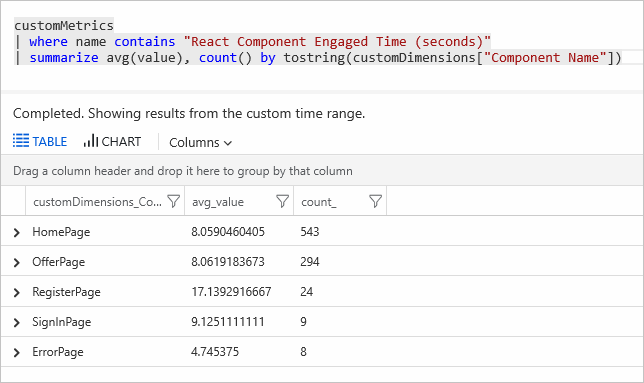

# React plugin for Application Insights JavaScript SDK

React plugin for the Application Insights JavaScript SDK, enables:

- Tracking of route changes
- React components usage statistics

## Getting started

Install npm package:

```bash

npm install @microsoft/applicationinsights-react-js

```

## Basic usage

```javascript
import React from 'react';
import { ApplicationInsights } from '@microsoft/applicationinsights-web';
import { ReactPlugin, withAITracking } from '@microsoft/applicationinsights-react-js';
import { createBrowserHistory } from "history";

const browserHistory = createBrowserHistory({ basename: '' });
var reactPlugin = new ReactPlugin();
var appInsights = new ApplicationInsights({
    config: {
        instrumentationKey: 'YOUR_INSTRUMENTATION_KEY_GOES_HERE'
        extensions: [reactPlugin],
        extensionConfig: {
          [reactPlugin.identifier]: { history: browserHistory }
        }
    }
});
appInsights.loadAppInsights();

// To instrument various React components usage tracking, apply the `withAITracking` higher-order
// component function.

class MyComponent extends React.Component {
    ...
}

export default withAITracking(reactPlugin,appInsights, MyComponent);

```

## Configuration

| Name    | Default | Description                                                                                                    |
|---------|---------|----------------------------------------------------------------------------------------------------------------|
| history | null    | React router history. For more information, see the [react-router package documentation](https://reactrouter.com/web/api/history). To learn how to access the history object outside of components, see the [React-router FAQ](https://github.com/ReactTraining/react-router/blob/master/FAQ.md#how-do-i-access-the-history-object-outside-of-components)    |

### React components usage tracking

To instrument various React components usage tracking, apply the `withAITracking` higher-order component function.

It will measure time from the `ComponentDidMount` event through the `ComponentWillUnmount` event. However, in order to make this more accurate, it will subtract the time in which the user was idle `React Component Engaged Time = ComponentWillUnmount timestamp - ComponentDidMount timestamp - idle time`.

To see this metric in the Azure portal you need to navigate to the Application Insights resource, select the "Metrics" tab and configure the empty charts to display custom metric name "React Component Engaged Time (seconds)", select aggregation (sum, avg, etc.) of your metric and apply split be "Component Name".


You can also run custom queries to divide Application Insights data to generate report and visualizations as per your requirements. In the Azure portal navigate to the Application Insights resource, select "Analytics" from the top menu of the Overview tab and run your query.



> [!NOTE]
> It can take up to 10 minutes for new custom metrics to appear in the Azure Portal.

## Sample app

Check out the [Application Insights React demo](https://github.com/Azure-Samples/application-insights-react-demo).

## Next steps

- To learn more about the JavaScript SDK, see the [Application Insights JavaScript SDK documentation](javascript.md).
- To learn about the Kusto query language and querying data in Log Analytics, see the [Log query overview](../../azure-monitor/log-query/log-query-overview.md).
