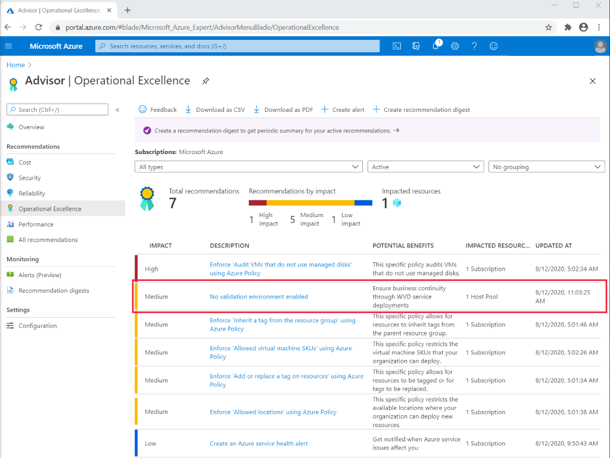
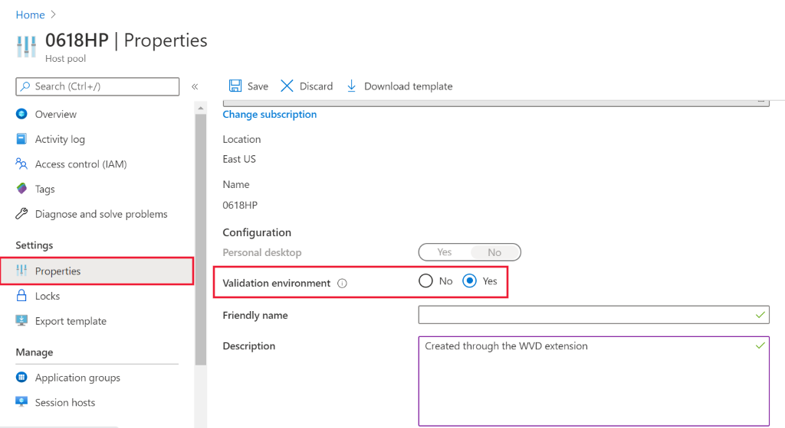
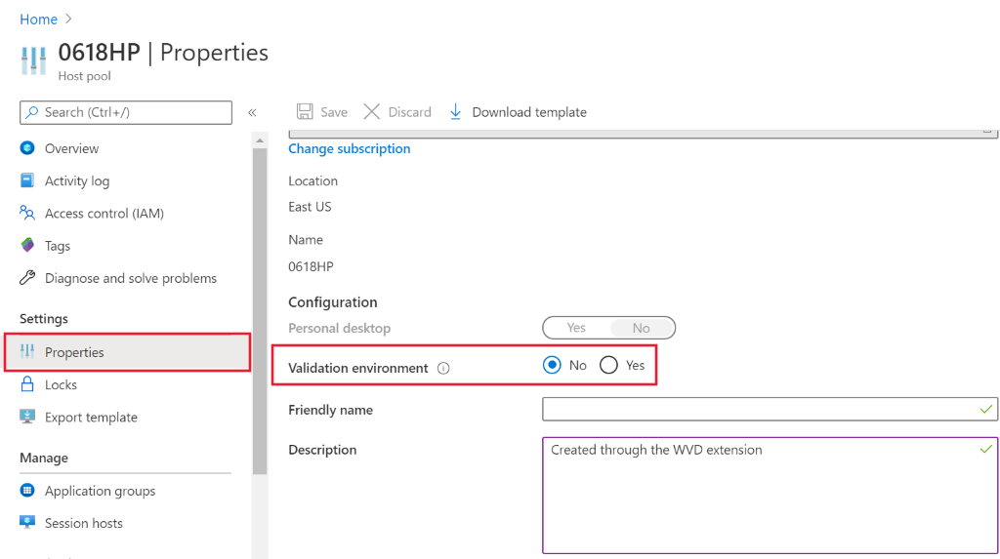

# How to resolve Azure Advisor recommendations

This article describes how you can resolve recommendations that appear in Azure Advisor for Windows Virtual Desktop.

## “No validation environment enabled”

>[!div class="mx-imgBorder"]
>

This recommendation appears under Operational Excellence. The recommendation should also show you a warning message like this:

"You don't have a validation environment enabled in this subscription. When you made your host pools, you selected **No** for "Validation environment" in the Properties tab. To ensure business continuity through Windows Virtual Desktop service deployments, make sure you have at least one host pool with a validation environment where you can test for potential issues.”

You can make this warning message go away by enabling a validation environment in one of your host pools.

To enable a validation environment:

1. Go to your Azure portal home page and select the host pool you want to change.

2. Next, select the host pool you want to change from a production environment to a validation environment.

3. In your host pool, select the **Properties** tab in the column on the right side of the screen. Next, scroll down until you see “Validation environment.” Select **Yes**, then select **Apply**.

>[!div class="mx-imgBorder"]
>

These changes won't make the warning go away immediately, but it should disappear eventually. Azure Advisor updates twice a day. Until then, you can postpone or dismiss the recommendation manually. We recommend you let the recommendation go away on its own. That way, Azure Advisor can let you know if it comes across any problems as the settings change.

## “Not enough production (non-validation) environments enabled”

This recommendation appears under Operational Excellence.

For this recommendation, the warning message appears for one of these reasons:

- You have too many host pools in your validation environment.
- You don't have any production host pools.

We recommend users have fewer than half of their host pools in a validation environment.

To resolve this warning:

1. Go to your Azure portal home page.

2. Select the host pools you want either want to change from validation to production.

3. In your host pool, select the **Properties** tab in the column on the right side of the screen. Next, scroll down until you see “Validation environment.” Select **No**, then select **Apply**.

>[!div class="mx-imgBorder"]
>

These changes won't make the warning go away immediately, but it should disappear eventually. Azure Advisor updates twice a day. Until then, you can postpone or dismiss the recommendation manually. We recommend you let the recommendation go away on its own. That way, Azure Advisor can let you know if it comes across any problems as the settings change.

## “Not enough links are unblocked to successfully implement your VM”

This recommendation appears under Operational Excellence.

You need to unblock specific URLs to make sure that your virtual machine (VM) functions properly. You can see the list at [Safe URL list](safe-url-list.md). If the URLs aren't unblocked, then your VM won't work properly.

To solve this recommendation, make sure you unblock all the URLs on the [Safe URL list](safe-url-list.md). You can use Service Tag or FQDN tags to unblock URLs, too.

## Propose new recommendations

You can help us improve Azure Advisor by submitting ideas for recommendations. Your recommendation could help another user out of a tough spot. To submit a suggestion, go to [our UserVoice forum](https://windowsvirtualdesktop.uservoice.com/forums/930847-azure-advisor-recommendations) and fill out the submission form. When you fill out the form, make sure to give us as much detail as possible.

## Next steps

If you're looking for more in-depth guides about how to resolve common issues, check out [Troubleshooting overview, feedback, and support for Windows Virtual Desktop](troubleshoot-set-up-overview.md).